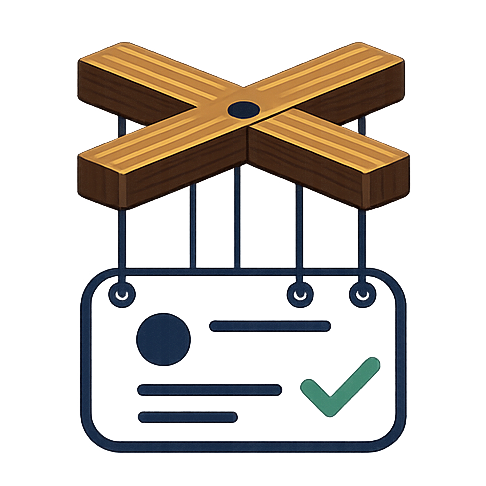

#  Puppets

[](https://github.com/JeffSteinbok/puppets/actions/workflows/ci.yml)
[](https://github.com/JeffSteinbok/puppets/actions/workflows/pages.yml)
[](LICENSE)

[](https://JeffSteinbok.github.io/puppets/)

Puppets is a pure cloud-based GitHub issue-to-PR automation harness. Each repository runs a
small caller workflow using GitHub Actions compute and keeps its policy, credentials, state,
issues, and pull requests in GitHub. There is no controller service, server, database, or
inbound webhook to deploy.

Standard GitHub-hosted runners are generally
[free for public repositories](https://docs.github.com/en/billing/reference/actions-runner-pricing).
Larger runners and model-provider usage may have separate costs.

## Supported providers

Puppets supports three implementation providers. Curation and acceptance review continue
to use Copilot regardless of which implementation provider a profile selects.

| Provider | `implementation.provider` | Repository settings |
|---|---|---|
| GitHub Copilot | `copilot` | Add `PUPPETS_TOKEN`; GitHub Actions installation tokens cannot assign coding agents. |
| Claude Code | `claude` | Add either `ANTHROPIC_API_KEY` or `CLAUDE_CODE_OAUTH_TOKEN`. |
| OpenAI Codex | `codex` | Add `OPENAI_API_KEY`. |

See [Select Provider](https://JeffSteinbok.github.io/puppets/getting-started.html#8-select-provider)
for workflow secret mappings, permissions, model overrides, and testing instructions.

## Principles

- The caller repository owns triggers, permissions, credentials, and local policy.
- This repository owns reusable orchestration, runtime code, defaults, schemas, tests, and
  documentation.
- Standard GitHub-hosted runner usage runs in the caller repository and is free for public
  repositories.
- No central controller, inbound webhook, or cross-repository mutation token is required.
- Approval provenance, the configured opt-out role, trusted-branch loading, and fork
  isolation fail closed and cannot be disabled by configuration.

## Install

1. Copy [`caller-template.yml`](caller-template.yml) to
   `.github/workflows/puppets.yml` in a public repository.
2. Add `.puppets/config.json`:

   ```json
   {
     "version": 1,
     "approvalActors": ["YOUR_GITHUB_LOGIN"]
   }
   ```

3. Optionally add `.puppets/workflow.yml` to overlay the versioned `basic` workflow DSL.
4. Add a repository-scoped `PUPPETS_TOKEN` only if the caller's `GITHUB_TOKEN` cannot
   perform Copilot assignment.
5. Run the workflow manually with `dry_run: true`.

See the [complete getting-started guide](https://JeffSteinbok.github.io/puppets/getting-started.html)
for the documented caller workflow, permissions, credentials, dry-run rollout, upgrades,
configuration, and repository-owned process integration.

## Development

```console
npm ci
npm run check
```

The runtime uses the locked GitHub Copilot SDK dependency. Tests use Node's built-in test
runner.
